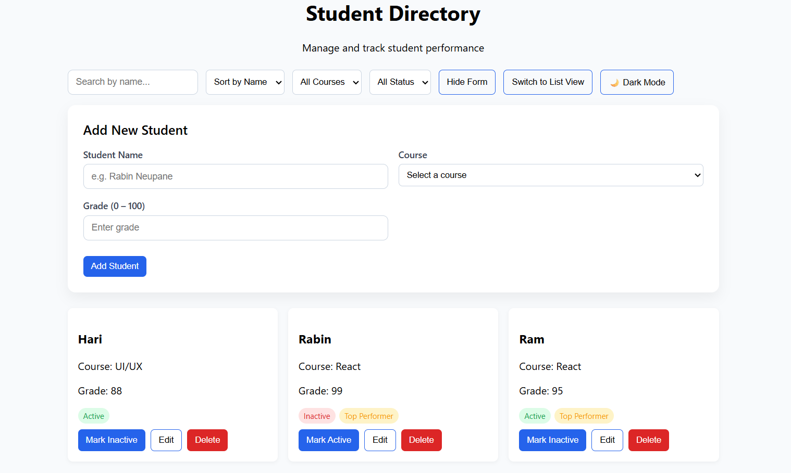
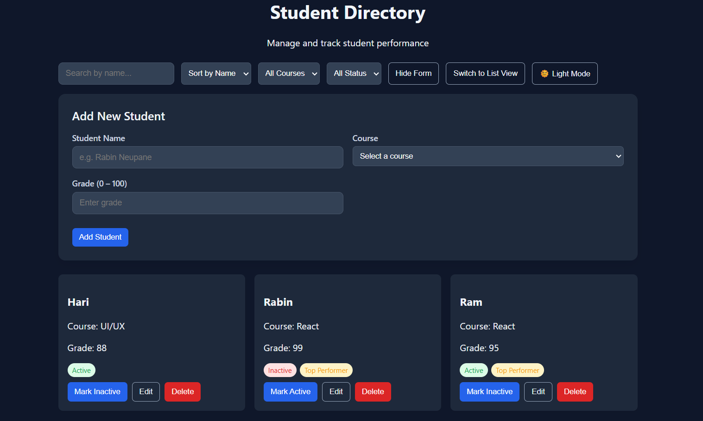
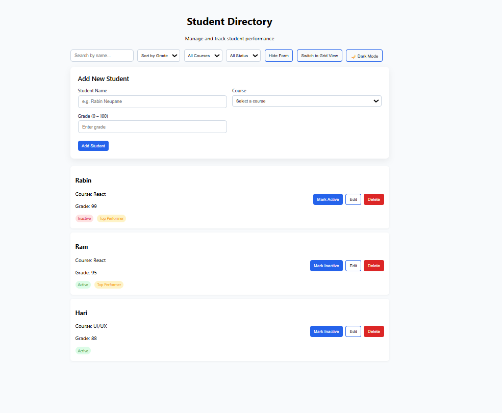
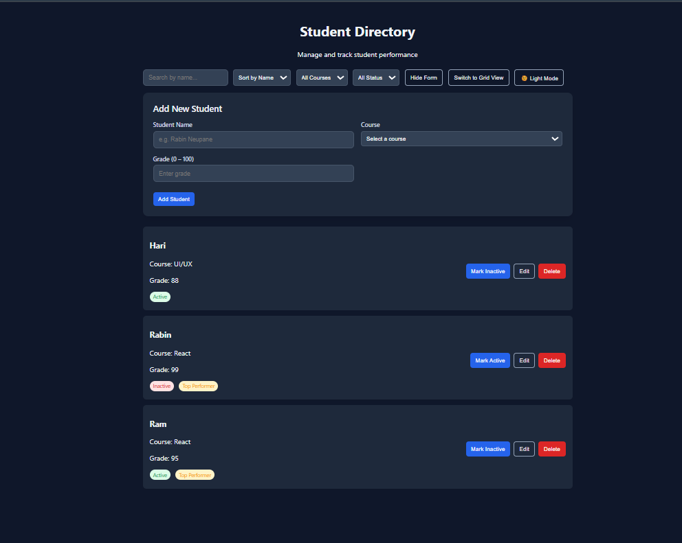
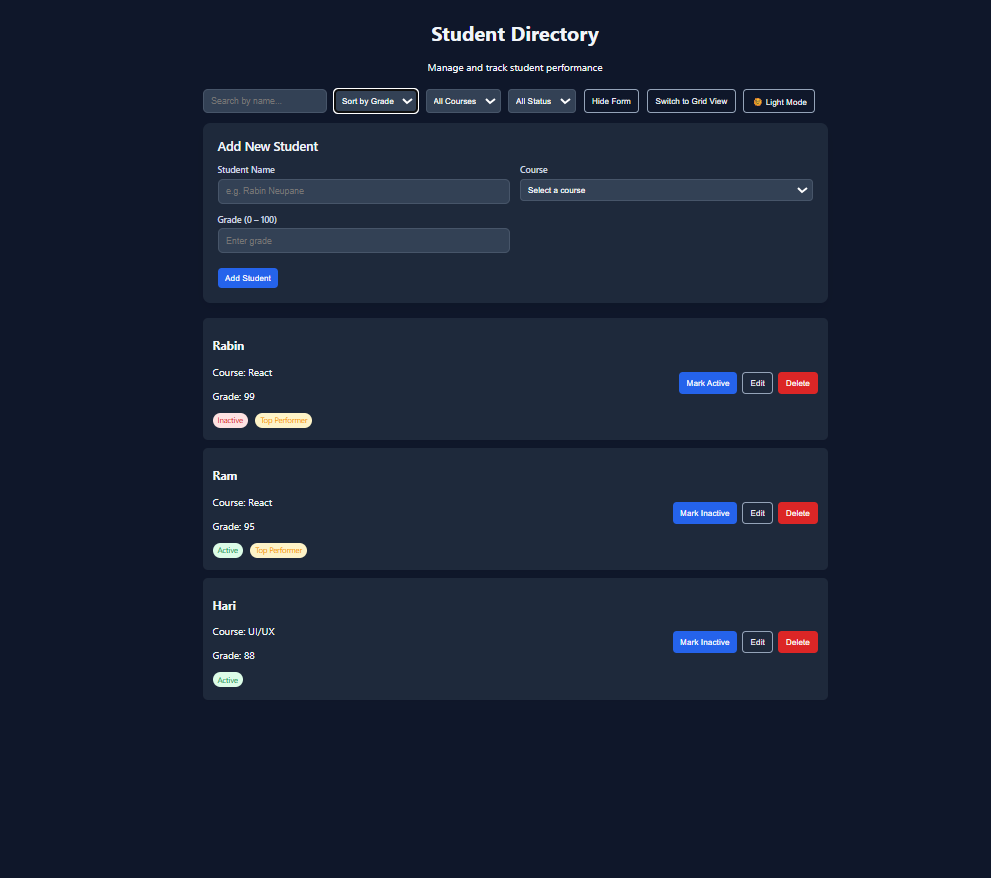

# Student Directory React App

A **responsive React application** to manage and track student performance. This app allows you to **add, edit, delete, search, filter, and sort students**, while supporting **dark mode**, **grid/list view toggle**, and **localStorage persistence**.  

---

## Features

- Add / Edit / Delete Students
- Search students by name
- Filter by course and attendance status
- Sort by name or grade
- Mark Attendance (Present / Absent)
- Top Performer Badge for high grades
- Dark Mode / Light Mode Toggle
- Grid / List View Toggle
- Responsive UI for mobile and desktop
- Persistent Data with `localStorage`

---

## Tech Stack

- **React.js** (Functional Components & Hooks)
- **CSS / Responsive Design**
- **LocalStorage** for data persistence
- Optional **Firebase Hosting** for deployment

---

## Screenshots

**Grid View (Light Mode)**  


**Grid View (Dark Mode)**  


**List View (Light Mode)**  


**List View (Dark Mode)**  


**Sort by grade List view (Dark Mode)**  


## Installation

1. Clone the repository:
[
```bash
git clone https://github.com/RabinNeupane/Student-Directory.git](https://github.com/RabinNeupane/Student-Directory.git)
